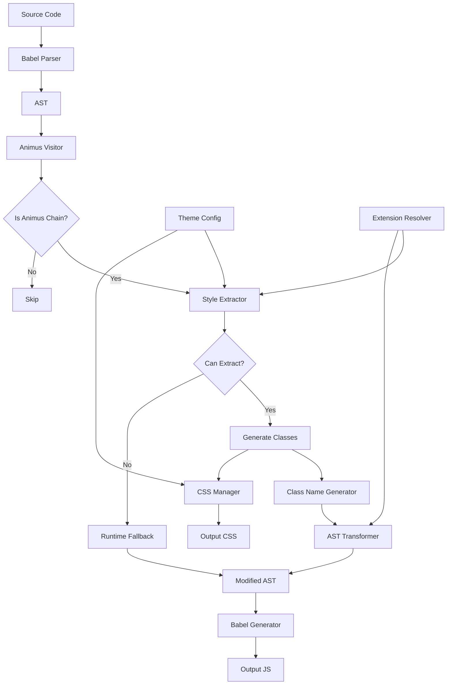

# Animus Babel Plugin Architecture

## Data Flow Diagram



## Component Interactions

### 1. Entry Point (Babel Plugin)
```javascript
// babel-plugin-animus.js
module.exports = function animusBabelPlugin(babel) {
  return {
    name: 'babel-plugin-animus',
    visitor: {
      Program(path, state) {
        // Initialize CSS manager
        state.cssManager = new CSSOutputManager(state.opts);
        // Initialize theme if configured
        state.theme = await loadTheme(state.opts.theme);
      },
      CallExpression(path, state) {
        // Main visitor logic
        const visitor = new AnimusVisitor(state);
        visitor.visit(path);
      }
    }
  };
};
```

### 2. Detection Flow
```
Import Detection → Variable Tracking → Chain Recognition → Extraction Decision
```

### 3. Extraction Flow
```
Parse Styles → Validate Static → Generate Atomic CSS → Create Class Names → Transform AST
```

### 4. Output Flow
```
Collect CSS → Deduplicate → Order by Cascade → Minify → Write to File/Module
```

## Key Design Decisions

### 1. Atomic CSS Strategy
- One class per CSS property
- Deterministic naming for deduplication
- Minimal specificity (single class selectors)

### 2. Cascade Preservation
```
Base Styles (0) → Variants (1) → States (2) → Props (3) → Inline (4)
```

### 3. Fallback Strategy
- Unsupported features use runtime generation
- Smooth degradation, not hard failures
- Clear console warnings in dev mode

### 4. Build Integration
- Plugin runs as standard Babel transform
- CSS output handled by build tool
- Source maps connect to original code

## File Structure

```
packages/core/babel-plugin/
├── src/
│   ├── index.ts                 # Main plugin entry
│   ├── visitor/
│   │   ├── AnimusVisitor.ts     # Core visitor pattern
│   │   ├── detector.ts          # Chain detection
│   │   └── tracker.ts           # Import/variable tracking
│   ├── extractor/
│   │   ├── StyleExtractor.ts    # Style extraction logic
│   │   ├── validators.ts        # Static validation
│   │   └── unsupported.ts       # Unsupported feature handling
│   ├── generator/
│   │   ├── ClassNameGenerator.ts # Class name generation
│   │   ├── atomic.ts            # Atomic CSS rules
│   │   └── collision.ts         # Collision detection
│   ├── transformer/
│   │   ├── ASTTransformer.ts    # AST modification
│   │   ├── runtime.ts           # Runtime fallback injection
│   │   └── sourcemap.ts         # Source map updates
│   ├── css/
│   │   ├── CSSOutputManager.ts  # CSS collection
│   │   ├── optimizer.ts         # Minification
│   │   └── output.ts            # File writing
│   ├── theme/
│   │   ├── ThemeResolver.ts     # Token resolution
│   │   ├── loader.ts            # Config loading
│   │   └── variables.ts         # CSS variable generation
│   └── extension/
│       ├── ExtensionResolver.ts  # Chain resolution
│       ├── merger.ts            # Style merging
│       └── tracker.ts           # Component tracking
├── tests/
│   ├── fixtures/               # Test cases
│   ├── unit/                   # Unit tests
│   └── integration/            # Full flow tests
└── package.json
```

## Performance Considerations

### Build Time
- AST traversal: O(n) where n = AST nodes
- Style extraction: O(m) where m = style properties  
- Class generation: O(1) with hash map
- CSS deduplication: O(p log p) where p = total properties

### Runtime
- Zero runtime CSS generation for extracted styles
- Minimal className merging logic
- No style object parsing

### Output Size
- Atomic CSS grows logarithmically with codebase
- Typical reduction: 60-80% vs runtime CSS-in-JS
- GZip compression highly effective

## Error Handling

### Build Errors
```typescript
class ExtractionError extends Error {
  constructor(
    public feature: string,
    public node: Node,
    public reason: string
  ) {
    super(`Cannot extract ${feature}: ${reason}`);
  }
}
```

### Runtime Fallbacks
```javascript
// Generated code for unsupported features
const Button = animus
  .styles({ 
    padding: '1rem',  // Extracted
    '&:hover': { ... } // Runtime fallback
  })
  ._withStaticClasses(['_p-1rem']) // Injected by plugin
  .asElement('button');
```

## Testing Strategy

### Unit Test Example
```typescript
describe('StyleExtractor', () => {
  it('should extract simple styles', () => {
    const ast = parseExpression(`{ padding: '1rem' }`);
    const result = extractor.extractStyles(ast);
    expect(result).toEqual([{
      property: 'padding',
      value: '1rem',
      className: '_p-1rem',
      css: '.p-1rem { padding: 1rem; }'
    }]);
  });
});
```

### Integration Test Example
```typescript
describe('Full Plugin Flow', () => {
  it('should transform component with styles', async () => {
    const input = `
      const Button = animus
        .styles({ padding: '1rem' })
        .asElement('button');
    `;
    
    const { code, css } = await transform(input);
    
    expect(code).toContain('_p-1rem');
    expect(css).toContain('.p-1rem { padding: 1rem; }');
  });
});
```