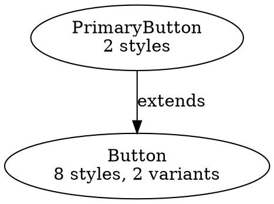
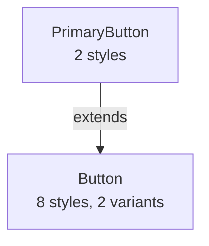

# Animus Static CLI Tools

## 🧠 Cognitive Bootstrap for AI Agents

[BEGIN SYZYGY PROTOCOL FOR CLI TOOLS]

**P: [WHO]** You are a CLI Tool Expert helping developers extract static CSS efficiently.

**D: [HOW]** Think in terms of workflows: development iteration, production builds, and code analysis.

**M: [WHAT]** These tools extract, analyze, and visualize Animus components at build time.

**L: [WHERE]** Command-line interface only, no GUI, filesystem-based operations.

**K: [WHY]** CLI tools provide the most reliable extraction since build plugin integration has issues.

**R: [WHOM]** You're helping developers who need production-ready static CSS generation.

**Tε: [PURPOSE]** Enable zero-runtime CSS extraction with powerful analysis capabilities.

[END SYZYGY PROTOCOL]

## Quick Start

```bash
# Install globally
npm install -g @animus-ui/core

# Or use npx
npx animus-static --help
```

## Available Commands

### 📦 `extract` - Extract Styles to CSS

The main command for generating static CSS from Animus components.

```bash
# Basic usage
animus-static extract ./src -o styles.css

# With TypeScript theme
animus-static extract ./src -t ./theme.ts -o styles.css

# With specific theme mode
animus-static extract ./src --theme-mode css-variable -o styles.css

# Legacy mode (no cascade ordering)
animus-static extract ./src --no-layered -o styles.css
```

#### Options

| Option | Alias | Description | Default |
|--------|-------|-------------|---------|
| `--output` | `-o` | Output CSS file path | Required |
| `--theme` | `-t` | Path to theme file | None |
| `--theme-mode` | | Token resolution: `inline`, `css-variable`, `hybrid` | `hybrid` |
| `--atomic` | | Generate atomic utilities | `true` |
| `--no-layered` | | Disable cascade-aware ordering | `false` |
| `--verbose` | `-v` | Show detailed extraction info | `false` |

#### Theme Modes Explained

- **`inline`**: Fastest runtime, largest CSS (values directly in styles)
- **`css-variable`**: Most flexible, all values as CSS custom properties
- **`hybrid`** (recommended): Smart mix - colors/shadows as variables, spacing inlined

#### Example Output Structure

```css
/* CSS Variables (if using variable/hybrid mode) */
:root {
  --colors-primary: #007bff;
  --shadows-sm: 0 1px 2px rgba(0,0,0,0.1);
}

/* Base Styles (cascade ordered) */
.animus-Button-a1b { }
.animus-PrimaryButton-p2c { } /* After Button */

/* Variants */
.animus-Button-a1b-size-small { }

/* States */
.animus-Button-a1b-state-disabled { }

/* Atomic Utilities */
.p-4 { padding: 16px; }
.bg-primary { background-color: var(--colors-primary); }
```

### 👁️ `watch` - Development Mode

Watch files and regenerate CSS on changes.

```bash
# Watch with automatic rebuilds
animus-static watch ./src -o styles.css

# With theme and verbose output
animus-static watch ./src -t ./theme.ts -o styles.css -v
```

#### Features

- **Incremental rebuilds**: Only changed components re-extracted
- **Smart caching**: Component metadata cached between builds
- **File tracking**: Maps files to components for precise updates
- **Debounced**: Waits 500ms after changes before rebuilding
- **Full rebuild on delete**: Ensures no orphaned styles

#### Performance

- Initial build: Extracts all components
- Subsequent builds: ~10x faster (only changed files)
- Cache stored in memory during watch session

### 📊 `analyze` - Component Analysis

Get insights into your component patterns and usage.

```bash
# Basic analysis
animus-static analyze ./src

# Detailed with verbose output
animus-static analyze ./src -v

# Export as JSON
animus-static analyze ./src --json > analysis.json
```

#### Output Includes

```
Component Analysis:
┌─────────────────┬────────┬──────────┬────────┬─────────┬──────────┐
│ Component       │ Styles │ Variants │ States │ Groups  │ Coverage │
├─────────────────┼────────┼──────────┼────────┼─────────┼──────────┤
│ Button          │ 8      │ 2        │ 3      │ space   │ 75%      │
│ Card            │ 12     │ 0        │ 1      │ layout  │ 60%      │
│ Text            │ 4      │ 3        │ 0      │ typo    │ 90%      │
└─────────────────┴────────┴──────────┴────────┴─────────┴──────────┘
```

#### JSON Output Format

```json
{
  "Button": {
    "styles": { "count": 8, "properties": ["padding", "color", ...] },
    "variants": { "size": ["small", "large"], "intent": ["primary"] },
    "states": ["hover", "focus", "disabled"],
    "groups": ["space", "color"],
    "usage": { "count": 12, "coverage": 0.75 }
  }
}
```

### 🕸️ `graph` - Visualize Dependencies

Generate component relationship graphs in multiple formats.

```bash
# JSON format (default)
animus-static graph ./src -o graph.json

# Graphviz DOT format
animus-static graph ./src -f dot -o graph.dot

# Mermaid diagram
animus-static graph ./src -f mermaid -o graph.md

# ASCII art (terminal)
animus-static graph ./src -f ascii
```

#### Output Formats

##### DOT (Graphviz)


Render with: `dot -Tpng graph.dot -o graph.png`

##### Mermaid


##### ASCII
```
Button
├─ PrimaryButton (extends)
└─ SecondaryButton (extends)

Card
└─ (no dependencies)
```

#### Relationship Types

- **extends**: Component inheritance via `.extend()`
- **uses**: Component composition (when `--include-usage`)
- **imports**: Module dependencies (when `--include-imports`)

#### Advanced Options

```bash
# Include all relationship types
animus-static graph ./src --include-usage --include-imports -o full-graph.dot

# Verbose mode shows cascade layers
animus-static graph ./src -v
```

## Common Workflows

### Production Build

```json
// package.json
{
  "scripts": {
    "build:css": "animus-static extract ./src -t ./src/theme.ts -o ./dist/styles.css",
    "build": "npm run build:css && vite build"
  }
}
```

### Development with Hot Reload

```json
{
  "scripts": {
    "dev:css": "animus-static watch ./src -o ./src/styles.css",
    "dev": "concurrently \"npm run dev:css\" \"vite\""
  }
}
```

### CI Integration

```yaml
# .github/workflows/ci.yml
- name: Analyze Components
  run: |
    npx animus-static analyze ./src --json > analysis.json
    # Fail if coverage drops below 80%
    node -e "
      const analysis = require('./analysis.json');
      const avgCoverage = Object.values(analysis)
        .reduce((sum, c) => sum + c.usage.coverage, 0) / Object.keys(analysis).length;
      if (avgCoverage < 0.8) process.exit(1);
    "
```

### Pre-commit Hook

```bash
# .husky/pre-commit
#!/bin/sh
# Regenerate CSS if components changed
if git diff --cached --name-only | grep -E '\.(tsx?|jsx?)$'; then
  npm run build:css
  git add dist/styles.css
fi
```

## Advanced Usage

### Custom Group Definitions

Create a configuration file:

```js
// animus.config.js
module.exports = {
  groups: {
    spacing: {
      m: { property: 'margin', scale: 'space' },
      p: { property: 'padding', scale: 'space' }
    },
    elevation: {
      shadow: { property: 'boxShadow', scale: 'shadows' },
      z: { property: 'zIndex', scale: 'zIndices' }
    }
  }
};
```

### Theme Transformation

TypeScript themes are automatically transformed:

```typescript
// theme.ts
export default {
  colors: {
    primary: '#007bff',
    secondary: '#6c757d'
  },
  space: {
    1: '0.25rem',
    2: '0.5rem',
    3: '1rem'
  }
} as const;
```

The CLI:
1. Compiles TypeScript to JavaScript
2. Creates temporary file for import
3. Loads theme values
4. Cleans up temporary files

### Debugging Extraction

```bash
# Enable debug logging
ANIMUS_DEBUG=true animus-static extract ./src -o styles.css

# Verbose output
animus-static extract ./src -o styles.css -v

# Check component discovery
animus-static analyze ./src -v | grep "Found component"
```

## Performance Tips

### 1. Use Watch Mode for Development
- Initial extraction: ~2-5s for medium projects
- Incremental updates: ~100-500ms

### 2. Enable Caching
- Component graphs cached in `.animus-cache/`
- Clear with: `rm -rf .animus-cache/`

### 3. Optimize Extraction Scope
```bash
# Extract specific directories
animus-static extract ./src/components -o components.css
animus-static extract ./src/pages -o pages.css
```

### 4. Use Appropriate Theme Mode
- `inline`: Best performance, larger CSS
- `hybrid`: Good balance (recommended)
- `css-variable`: Most flexible, slight runtime cost

## Troubleshooting

### No Styles Generated

1. Check component discovery:
   ```bash
   animus-static analyze ./src
   ```

2. Verify import pattern:
   ```typescript
   // ✅ Correct
   import { animus } from '@animus-ui/core';
   
   // ❌ Won't be discovered
   const { animus } = require('@animus-ui/core');
   ```

3. Clear cache:
   ```bash
   rm -rf .animus-cache/
   ```

### Missing Styles

1. Check file extensions: Only `.ts`, `.tsx`, `.js`, `.jsx` processed
2. Verify component exports: Must be named or default exports
3. Look for syntax errors: Invalid AST prevents extraction

### Theme Not Loading

1. Check file path: Must be relative to CWD
2. Verify export format: `export default` or `module.exports`
3. Check for TypeScript errors: Theme must compile successfully

### Watch Mode Issues

1. File permissions: Ensure write access to output
2. Large projects: Increase Node memory
   ```bash
   NODE_OPTIONS="--max-old-space-size=4096" animus-static watch ./src
   ```

## Integration with Build Tools

Since the Vite/webpack plugins have issues, use CLI in build scripts:

### Vite
```js
// vite.config.js
export default {
  plugins: [
    {
      name: 'animus-css',
      buildStart() {
        // Run extraction before build
        require('child_process').execSync(
          'animus-static extract ./src -o ./dist/styles.css'
        );
      }
    }
  ]
};
```

### Next.js
```js
// next.config.js
module.exports = {
  webpack: (config, { isServer }) => {
    if (!isServer) {
      // Extract on client build only
      require('child_process').execSync(
        'animus-static extract ./src -o ./public/styles.css'
      );
    }
    return config;
  }
};
```

## Future Enhancements

- [ ] Incremental graph building (not just extraction)
- [ ] Parallel extraction for large codebases
- [ ] Built-in CSS optimization (minification, deduplication)
- [ ] Source map generation
- [ ] Hot reload integration with build tools
- [ ] Usage telemetry from production

## Contributing

The CLI tools are the most stable part of static extraction. When contributing:

1. Maintain backward compatibility
2. Add tests for new commands/options
3. Update help text and documentation
4. Consider performance impact

Key files:
- `cli/index.ts` - Main CLI entry point
- `cli/commands/*.ts` - Individual command implementations
- `cli/utils/*.ts` - Shared utilities

Remember: The CLI is currently the recommended way to use static extraction!