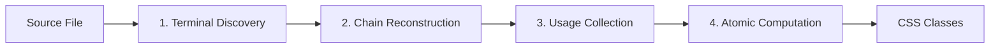

# Animus V2 Static Extraction Architecture

## Quick Start

The Static Extraction V2 system analyzes TypeScript code to extract style information from Animus UI components at build time. It identifies component definitions, tracks their usage, and generates atomic CSS classes based on actual prop usage in JSX.

### Directory Structure

```
v2/
├── index.ts                 # Main entry point - createStaticExtractor()
├── orchestrator.ts          # Coordinates all phases of extraction
├── phases/                  # Extraction phases (core logic)
│   ├── terminalDiscovery.ts # Phase 1: Find component endpoints
│   ├── chainReconstruction.ts # Phase 2: Build component definitions
│   ├── usageCollection.ts   # Phase 3: Find JSX usages
│   └── atomicComputation.ts # Phase 4: Generate atomic CSS
├── extraction/              # Style extraction utilities
│   ├── styleExtractor.ts    # Extract styles from AST nodes
│   ├── styleResolver.ts     # Resolve theme tokens and transforms
│   └── spreadTracer.ts      # Trace spread operators
├── infrastructure/          # Core system services
│   ├── cache.ts            # Caching for extraction results
│   ├── diagnostics.ts      # Performance and error tracking
│   ├── errors.ts           # Error handling
│   ├── logger.ts           # Logging with scoped contexts
│   └── performance.ts      # Performance monitoring
├── registry/               # PropRegistry configuration
│   └── propRegistryExtractor.ts # Extract prop mappings from types
├── utils/                  # General utilities
│   └── config.ts           # Default configuration
└── types/                  # TypeScript type definitions
    ├── core.ts             # Core interfaces
    ├── phases.ts           # Phase-specific types
    ├── extraction.ts       # Extraction result types
    └── index.ts            # Type exports
```

## Core Concepts

### 1. Four-Phase Extraction Pipeline



1. **Terminal Discovery**: Find `.asElement()`, `.asComponent()`, `.build()` calls
2. **Chain Reconstruction**: Walk up to build full component definition
3. **Usage Collection**: Find all JSX usages of the component
4. **Atomic Computation**: Generate atomic CSS from actual prop usage

### 2. Complete System Architecture

```mermaid
graph TB
    %% Style definitions
    classDef critical fill:#dc2626,stroke:#991b1b,color:#fff,stroke-width:3px;
    classDef primary fill:#2563eb,stroke:#1d4ed8,color:#fff,stroke-width:2px;
    classDef phase fill:#dbeafe,stroke:#3b82f6,stroke-width:2px,font-weight:bold;
    classDef shared fill:#fef3c7,stroke:#f59e0b,stroke-width:2px;
    classDef utility fill:#d1fae5,stroke:#059669,stroke-width:1px;
    classDef data fill:#e0e7ff,stroke:#6366f1,stroke-width:1px,stroke-dasharray: 5 5;
    classDef output fill:#86efac,stroke:#16a34a,stroke-width:3px;

    %% ENTRY & ORCHESTRATION
    Entry[createStaticExtractor<br/>📍 index.ts]:::critical
    Orchestrator[🎯 StaticExtractionOrchestrator<br/>orchestrator.ts<br/>Manages phases & context]:::primary

    Entry ==> Orchestrator

    %% SHARED CONTEXT (Critical for all phases)
    subgraph ExtractionContext ["🧠 ExtractionContext (Shared Memory)"]
        direction TB
        TS[TypeScript APIs<br/>typeChecker/program/sourceFile]
        Registries[Registries<br/>component/usage/symbol/prop]
        Services[Services<br/>logger/cache/diagnostics/monitor]
        Config[Config & Theme]
    end
    class ExtractionContext shared;

    Orchestrator ==> ExtractionContext

    %% PHASE PIPELINE
    Input[/"📄 Source File"/]:::data

    %% Phase 1
    P1[Phase 1: Terminal Discovery<br/>📍 terminalDiscovery.ts<br/>Find: .asElement() .asComponent() .build()]:::phase
    T1[/"TerminalNode[]<br/>Component endpoints"/]:::data

    %% Phase 2
    P2[Phase 2: Chain Reconstruction<br/>📍 chainReconstruction.ts<br/>Walk up AST → Build definition]:::phase
    T2[/"ComponentDefinition<br/>Full component config"/]:::data

    %% Phase 3
    P3[Phase 3: Usage Collection<br/>📍 usageCollection.ts<br/>Find all <Component /> usages]:::phase
    T3[/"ComponentUsage[]<br/>Props used in JSX"/]:::data

    %% Phase 4
    P4[Phase 4: Atomic Computation<br/>📍 atomicComputation.ts<br/>Generate CSS from usage]:::phase
    Result[/"🎉 ExtractionResult<br/>CSS classes + metadata"/]:::output

    %% Main flow
    Input --> P1
    P1 --> T1
    T1 --> P2
    P2 --> T2
    T2 --> P3
    P3 --> T3
    T2 --> P4
    T3 --> P4
    P4 --> Result

    %% Phase context access
    P1 -.-> ExtractionContext
    P2 -.-> ExtractionContext
    P3 -.-> ExtractionContext
    P4 -.-> ExtractionContext

    %% EXTRACTION UTILITIES
    subgraph Utilities ["🛠️ Extraction Utilities"]
        direction LR
        SE[StyleExtractor<br/>📍 styleExtractor.ts<br/>AST → styles]:::utility
        SR[StyleResolver<br/>📍 styleResolver.ts<br/>Tokens → values]:::utility
        ST[SpreadTracer<br/>📍 spreadTracer.ts<br/>Follow spreads]:::utility
    end

    %% INFRASTRUCTURE
    subgraph Infra ["⚙️ Infrastructure"]
        direction LR
        Cache[Cache<br/>📍 cache.ts]:::utility
        Logger[Logger<br/>📍 logger.ts]:::utility
        Diag[Diagnostics<br/>📍 diagnostics.ts]:::utility
        Err[Errors<br/>📍 errors.ts]:::utility
        Perf[Performance<br/>📍 performance.ts]:::utility
    end

    %% Utility connections
    P2 ==> SE
    P3 ==> ST
    P4 ==> SR

    %% Infrastructure connections
    Orchestrator --> Infra

    %% Key insights box
    Note[📌 KEY INSIGHTS<br/>1. Context = shared state for all phases<br/>2. Each phase has single responsibility<br/>3. Data flows linearly with clear types<br/>4. Infrastructure provides cross-cutting concerns]:::critical

    Result -.-> Note
```

### 3. Unified Phase Interface

All phases implement the same interface:

```typescript
interface Phase<TInput, TOutput> {
  readonly name: ExtractionPhase;
  execute(context: ExtractionContext, input: TInput): TOutput;
}
```

### 4. Extraction Context

A single context object flows through all phases containing:
- TypeScript compiler APIs (typeChecker, program, sourceFile)
- Shared registries (components, usages, symbols)
- Infrastructure services (logger, cache, diagnostics)
- Configuration and PropRegistry

## How It Works

### Entry Point

```typescript
// Create extractor
const extractor = createStaticExtractor(config);

// Extract from a file
const result = extractor.extractFile('MyComponent.tsx');
```

### Data Flow

1. **Orchestrator** creates an ExtractionContext with TypeScript APIs
2. **Phase 1** finds all terminal nodes (component endpoints)
3. For each terminal:
   - **Phase 2** reconstructs the component definition chain
   - **Phase 3** finds all JSX usages in the file
   - **Phase 4** generates atomic CSS classes from prop usage
4. Results are cached and returned

### Key Implementation Details

#### PropRegistry
- Defines how props map to CSS properties (e.g., `mx` → `marginLeft, marginRight`)
- Extracted once per file from the Animus import
- Shared across all components in the file

#### Atomic Class Generation
- Only generates CSS for props actually used in JSX
- Handles responsive values (arrays/objects)
- Supports theme token resolution
- Generates both global and component-scoped classes

#### Style Extraction
- `StyleExtractor` parses style objects from AST
- `StyleResolver` handles theme tokens and transforms
- `SpreadTracer` follows spread operators to their sources

## Quick Navigation Guide

### To understand a specific phase:
1. Start with the phase file in `phases/`
2. Look at its input/output types in `types/phases.ts`
3. Check how it's called in `orchestrator.ts`

### To debug extraction:
1. Enable debug logging in config
2. Check `infrastructure/diagnostics.ts` for performance metrics
3. Use `infrastructure/logger.ts` scoped loggers
4. Review cached results in `infrastructure/cache.ts`

## Current Limitations

1. **Single File Scope**: Only analyzes one file at a time
2. **Theme Resolution**: Basic implementation, no deep theme extraction
3. **Variants/States**: Detected but not fully processed
4. **Cross-File Usage**: Detected but not followed

## Configuration

Default configuration is in `utils/config.ts`:

```typescript
{
  phases: {
    discovery: { terminalMethods: ['asElement', 'asComponent', 'build'] },
    reconstruction: { maxChainLength: 50 },
    collection: { searchScope: 'file', maxSpreadDepth: 3 },
    computation: { mergeStrategy: 'smart' }
  },
  errorStrategy: 'continue',
  cacheStrategy: 'memory',
  monitoring: true
}
```

## Testing

Tests are in `__tests__/` with snapshots in `__tests__/__snapshots__/`.

Run tests: `yarn test packages/core/src/v2`

## Next Steps

See `HANDOFF_SUMMARY.md` for current development status and planned work.
