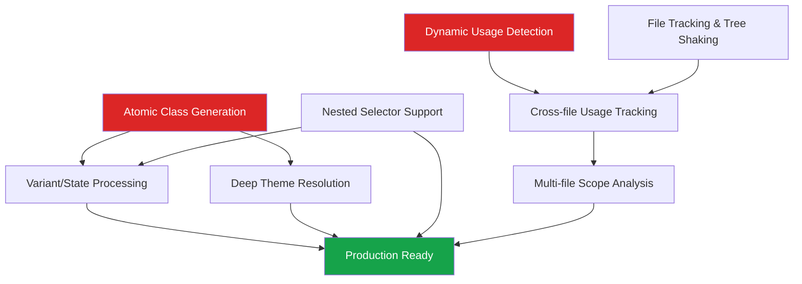

# V2 Feature Proposals

This directory contains detailed proposals for features in the Animus V2 Static Extraction system.

## Feature Overview

### Core Infrastructure Features

#### 1. [Test Infrastructure](./test-infrastructure.md)
- **Phase**: All phases (testing support)
- **Priority**: Critical
- **Complexity**: Low
- **Status**: Enables rapid development

#### 2. [Atomic Class Generation](./atomic-class-generation.md)
- **Phase**: 4 (Atomic Computation)
- **Priority**: Critical
- **Complexity**: Medium
- **Status**: Fundamental for prop system

#### 3. [Dynamic Usage Detection](./dynamic-usage-detection.md)
- **Phase**: 3 (Usage Collection)
- **Priority**: High
- **Complexity**: Medium
- **Status**: Required for runtime fallbacks

### Extraction Enhancement Features

#### 4. [Variant/State Processing](./variant-state-processing.md)
- **Phase**: 2 & 4 (Reconstruction & Computation)
- **Priority**: High
- **Complexity**: Medium
- **Status**: Core Animus feature

#### 5. [Deep Theme Resolution](./deep-theme-resolution.md)
- **Phase**: 4 (Atomic Computation)
- **Priority**: High
- **Complexity**: Medium
- **Status**: CSS variable integration

#### 6. [Nested Selector Support](./nested-selector-support.md)
- **Phase**: 4 (Atomic Computation)
- **Priority**: Medium
- **Complexity**: Medium
- **Status**: Full CSS selector support

### Cross-file Features

#### 7. [Cross-file Usage Tracking](./cross-file-usage-tracking.md)
- **Phase**: 3 (Usage Collection)
- **Priority**: Medium
- **Complexity**: Medium
- **Status**: Foundation for multi-file

#### 8. [File Tracking & Tree Shaking](./file-tracking-tree-shaking.md)
- **Phase**: Orchestrator level
- **Priority**: Medium
- **Complexity**: High
- **Status**: Production optimization

#### 9. [Multi-file Scope Analysis](./multi-file-scope-analysis.md)
- **Phase**: Orchestrator level
- **Priority**: Critical
- **Complexity**: High
- **Status**: Enables production use

## Implementation Order

Based on dependencies and value delivery, the recommended implementation order is:

### Phase 0: Foundation (Immediate)
Enable rapid development and testing:

1. **Test Infrastructure** - Testing helpers and utilities

### Phase 1: Core Infrastructure (Sequential)
Must be implemented first as other features depend on them:

2. **Atomic Class Generation** - Foundation for all prop-based styles
3. **Dynamic Usage Detection** - Required for runtime fallback system

### Phase 2: Feature Completion (Parallel)
Can be implemented in parallel as they enhance different aspects:

4. **Variant/State Processing** - Completes core Animus patterns
5. **Deep Theme Resolution** - Enables proper theme token resolution
6. **Nested Selector Support** - Full CSS selector capabilities

### Phase 3: Single-file Optimization
Prepares for multi-file with file awareness:

7. **File Tracking & Tree Shaking** - Adds file-level tracking infrastructure

### Phase 4: Multi-file Support (Sequential)
Builds on previous phases:

8. **Cross-file Usage Tracking** - Identifies cross-file dependencies
9. **Multi-file Scope Analysis** - Full production-ready extraction

## Feature Dependencies

## Quick Decision Matrix

| Feature | Standalone Value | Implementation Risk | User Impact |
|---------|-----------------|-------------------|-------------|
| Test Infrastructure | Critical | Low | Critical - Development speed |
| Atomic Classes | Critical | Low | Critical - Enables props |
| Dynamic Detection | High | Medium | High - Runtime reliability |
| Variants/States | High | Medium | High - Core patterns |
| Deep Theme | High | Low | High - Accurate styles |
| Nested Selectors | Medium | Low | High - CSS completeness |
| File Tracking | Medium | Medium | Medium - Bundle size |
| Cross-file | Low | Low | Medium - Prep work |
| Multi-file | Critical | High | Critical - Production use |

## Testing Strategy

Each feature includes:
1. Unit tests for new utilities
2. Integration tests with real Animus code
3. Snapshot tests for output validation
4. Performance benchmarks where relevant

## Architecture Principles

All implementations must follow:
1. Single responsibility per phase
2. Linear data flow (no backwards dependencies)
3. Shared state through ExtractionContext only
4. Clear separation of phase logic vs infrastructure
5. Comprehensive error handling and recovery

## Review Process

1. Proposal review and approval
2. Type definitions first
3. Implementation with tests
4. Documentation updates
5. Performance validation
6. Integration verification

## Success Metrics

- All features maintain sub-100ms per-file performance
- Memory usage scales linearly with file count
- Zero breaking changes to existing API
- 100% test coverage for new code
- Clear documentation for each feature

## Key Architectural Decisions

### Dual Class System
- **Atomic classes**: Global, reusable utility classes (`animus-p-4`)
- **Component classes**: Scoped style classes (`animus-Button-abc-size-small`)

### CSS Generation Strategy
- Single class with media queries for responsive styles
- CSS variables for theme tokens (build-time resolution, runtime flexibility)
- Component-scoped class names using consistent hashing

### Dynamic Handling
- TypeScript's type system prevents most dynamic cases
- When detected, flag for runtime handling rather than trying to resolve
- Generate all variant possibilities when unsure (accept the bytes)

### File Optimization
- Track component-to-file relationships for tree shaking
- Global atomic class pool with deduplication
- Extended components treated as independent entities

### Implementation Philosophy
- Trust TypeScript's type system internally
- Be defensive with external/JSX usage
- Prioritize correctness over optimization
- Leave breadcrumbs for future debugging